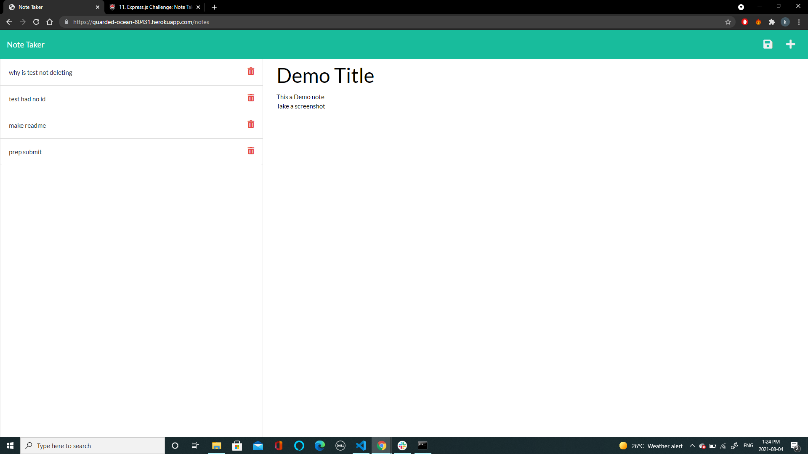

# Team page Generator

## Description

This app creates Notes! Enter a note, save notes, delete old notes. Great for planning purposes!

## Live Site

See Note taker here: https://guarded-ocean-80431.herokuapp.com

## Table of Contents

- [Usage](#usage)
- [Credits](#credits)
- [License](#license)
- [Contributing](#contributing)
- [Contact](#contact)

## Usage

Navigate to notes. Add note title, then add the body. Click save icon to save. once you have notes click garbbage can to delete

## Credits

Jacob Banks,

## License

This project is [MIT](https://choosealicense.com/licenses/mit/) licensed. 
Copyright © 2021 [JACOB BANKS](https://github.com/jacob-banks)

## Contributing

Please feel free to add to or adjust any file. Fork away!. Please contact me for more info. Email kobyBanks@gmail.com

## Contact

Contact Jacob Banks with any questions! 
Github link: [jacob-banks](https://github.com/jacob-banks) 
Email: kobybanks@gmail.com
